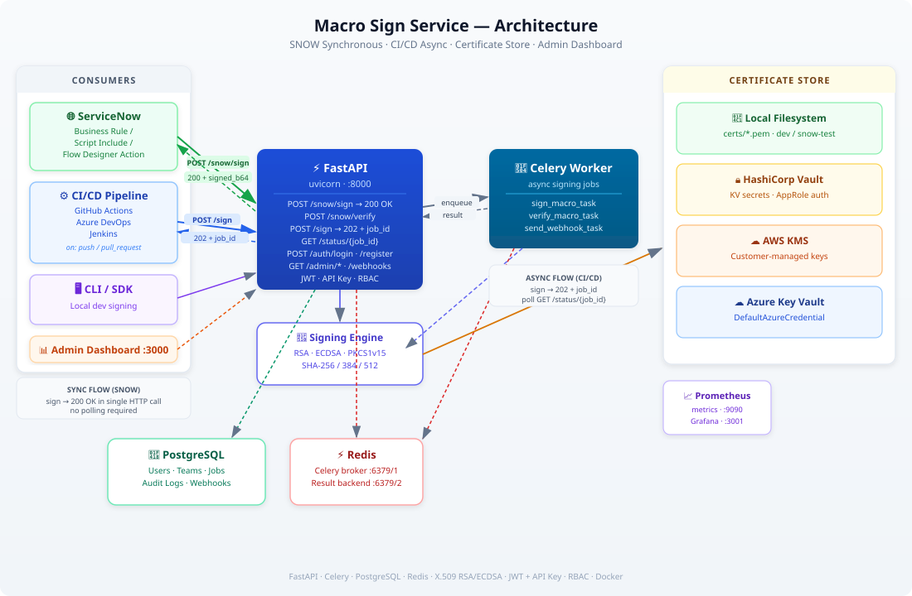

# Macro Sign Service

> Enterprise-grade macro signing service that automates digital signing of Office macros (VBA) for speed, security, and compliance.

[](LICENSE)

---

## What is this?

Organizations that use Office macros face a constant challenge: **unsigned macros are a security risk**, but manually signing them slows down development. Macro Sign Service solves this by providing a centralized, automated signing service that integrates into your existing **CI/CD pipelines** and **ServiceNow (SNOW) workflows**.

### Key Features

- **Synchronous SNOW signing** — ServiceNow forms submit a macro and receive the signed content back in a single HTTP call (no polling)
- **Async CI/CD signing** — Pipeline check-in events trigger signing jobs processed by Celery workers
- **Certificate Management** — Integrates with Azure Key Vault, AWS KMS, HashiCorp Vault, and local filesystem
- **Audit Trail** — Every signing operation is logged with user, IP, file hash, and certificate fingerprint
- **Role-Based Access Control** — Granular permissions for admins, managers, developers, and viewers
- **Admin Dashboard** — Web UI for managing certificates, viewing signing history, and monitoring usage
- **CLI Tool** — Sign macros locally during development

---

## Architecture

The service supports two distinct consumer patterns: **ServiceNow GUI** (synchronous, returns signed content directly) and **CI/CD pipelines** (asynchronous, job-based).



### SNOW Synchronous Flow

```
SNOW Form  ──[POST /api/v1/snow/sign  file + requester_id]──▶  API
                                                                  │ validate
                                                                  │ get_or_create_certificate("snow-test-domain")
                                                                  │ sign (RSA SHA-256)
           ◄──[200 OK  signed_content_b64 + signature + cert]──  │
SNOW stores signature in record field
SNOW later  ──[POST /api/v1/snow/verify  file + signature]──▶  API
           ◄──[200 OK  is_valid: true/false]──────────────────   │
```

### CI/CD Check-in Flow

```
Developer pushes code
       │
       ▼
  Pipeline trigger (on: push / pull_request)
       │
       ▼
  POST /api/v1/sign  ──▶  202 Accepted  { job_id }
       │
       ▼
  Poll GET /api/v1/status/{job_id}  until  status == "completed"
       │
       ▼
  Retrieve signature + file_hash from response
       │
       ▼
  Store / publish signed artifact
```

---

## Getting Started

### Prerequisites

- Docker & Docker Compose
- Python 3.11+ (for local development)
- A code-signing certificate (self-signed generated automatically for dev, CA-issued for production)

### Quick Start

```bash
# Clone the repository
git clone https://github.com/ojask7/macro-sign-service.git
cd macro-sign-service

# Copy environment config
cp .env.example .env

# Start all services
docker-compose up -d

# Verify it's running
curl http://localhost:8000/api/v1/health
```

### Local Development

```bash
python -m venv venv
source venv/bin/activate
pip install -r requirements.txt
uvicorn src.main:app --reload --port 8000
make test
```

On startup the service automatically generates:
- `certs/default.pem` — general-purpose dev signing certificate
- `certs/snow-test-domain.pem` — pre-provisioned certificate for SNOW test-domain signing

---

## API Reference

### ServiceNow Integration (Synchronous)

| Method | Endpoint | Description |
|--------|----------|-------------|
| POST | `/api/v1/snow/sign` | Sign a macro and return signed content **immediately** (200 OK, no polling) |
| POST | `/api/v1/snow/verify` | Verify a previously signed macro |
| GET | `/api/v1/snow/certs` | List available certificates in the key store |

### Standard Signing (Asynchronous)

| Method | Endpoint | Description |
|--------|----------|-------------|
| POST | `/api/v1/sign` | Submit a macro for async signing (202 Accepted + job_id) |
| GET | `/api/v1/status/{job_id}` | Poll signing job status |
| POST | `/api/v1/verify` | Verify a signed macro |
| GET | `/api/v1/health` | Health check |

### SNOW Signing Example

```bash
# Sign a macro — response returns signed content immediately
curl -X POST http://localhost:8000/api/v1/snow/sign \
  -H "X-API-Key: mss_your_api_key" \
  -F "file=@report_macro.vba" \
  -F "requester_id=sys_u_abc123" \
  -F "algorithm=sha256"
```

**Response (200 OK):**
```json
{
  "status": "signed",
  "original_filename": "report_macro.vba",
  "file_size": 1024,
  "signed_content_b64": "QXR0cmlidXRlIFZCX05hbWUg...",
  "signature": "3045022100abcdef...",
  "file_hash": "a1b2c3d4...",
  "certificate_fingerprint": "AB:CD:EF:...",
  "certificate_subject": "CN=snow-test.macro-sign.local,O=SNOW Test Domain,C=US",
  "certificate_pem": "-----BEGIN CERTIFICATE-----\n...",
  "algorithm": "sha256",
  "signed_at": "2026-02-23T10:00:00Z",
  "requester_id": "sys_u_abc123",
  "domain": "snow-test-domain"
}
```

### CI/CD Pipeline Example (GitHub Actions)

```yaml
- name: Sign VBA macro on check-in
  env:
    MACRO_SIGN_URL: ${{ vars.MACRO_SIGN_URL }}
    MACRO_SIGN_API_KEY: ${{ secrets.MACRO_SIGN_API_KEY }}
  run: |
    # Submit signing job
    JOB_ID=$(curl -sf -X POST "$MACRO_SIGN_URL/api/v1/sign" \
      -H "X-API-Key: $MACRO_SIGN_API_KEY" \
      -F "file=@src/macros/report.vba" \
      | jq -r '.job_id')

    # Poll until complete
    for i in $(seq 1 30); do
      RESULT=$(curl -sf "$MACRO_SIGN_URL/api/v1/status/$JOB_ID" \
        -H "X-API-Key: $MACRO_SIGN_API_KEY")
      STATUS=$(echo "$RESULT" | jq -r '.status')
      [ "$STATUS" = "completed" ] && break
      [ "$STATUS" = "failed" ] && exit 1
      sleep 2
    done

    echo "Signature: $(echo $RESULT | jq -r '.signature')"
```

---

## Project Structure

```
macro-sign-service/
├── .github/workflows/      # CI/CD pipelines
├── src/
│   ├── api/
│   │   ├── snow.py         # ServiceNow synchronous signing endpoints
│   │   ├── signing.py      # Async signing endpoints (sign/status/verify)
│   │   ├── auth.py         # Authentication & API key management
│   │   ├── admin.py        # Admin: users, teams, profiles, audit
│   │   ├── health.py       # Health / readiness / liveness probes
│   │   └── webhooks.py     # Webhook management
│   ├── core/
│   │   ├── signing_engine.py     # RSA/ECDSA signing & verification
│   │   └── certificate_store.py  # Local / Vault / AWS / Azure backends
│   ├── auth/               # JWT, API keys, RBAC
│   ├── models/             # SQLAlchemy ORM + Pydantic schemas
│   ├── queue/              # Celery tasks
│   ├── utils/              # File validator, rate limiter
│   └── config/             # Settings, logging
├── tests/
│   ├── unit/               # 79 unit tests
│   └── integration/
│       └── test_snow_integration.py  # 46 SNOW end-to-end tests
├── dashboard/              # Admin web UI (Next.js)
├── cli/                    # CLI tool
├── docs/                   # API.md, DEPLOYMENT.md
├── deploy/                 # Docker & Helm charts
├── docker-compose.yml
├── Makefile
└── DEVELOPER_GUIDE.md
```

---

## Security

- All signing operations are logged with full audit trails (user, IP, file hash, cert fingerprint)
- Private keys are fetched from secure vaults at runtime — never written to application logs
- API authentication via JWT bearer tokens and API keys with RBAC
- Webhook payloads signed with HMAC-SHA256
- File uploads scanned for dangerous shell patterns before signing
- Regular security scanning via GitHub Advanced Security

---

## Roadmap

- [x] Core signing engine (RSA/ECDSA, SHA-256/384/512)
- [x] REST API with JWT + API key authentication
- [x] Async signing via Celery workers
- [x] Certificate store integration (Local, HashiCorp Vault, AWS KMS, Azure Key Vault)
- [x] ServiceNow synchronous signing integration (`/snow/sign`)
- [x] CI/CD pipeline integration (GitHub Actions, Azure DevOps, Jenkins)
- [x] Admin dashboard (Next.js)
- [x] CLI tool
- [x] Kubernetes deployment (Helm charts)
- [ ] Bulk signing API (batch multiple files in one request)
- [ ] Distributed rate limiting (Redis-backed)
- [ ] Certificate expiry alerts
- [ ] HSM / PKCS#11 support

---

## Contributing

1. Fork the repository
2. Create your feature branch (`git checkout -b feature/amazing-feature`)
3. Commit your changes
4. Push to the branch and open a Pull Request

---

## License

Apache License 2.0 — see the [LICENSE](LICENSE) file for details.

---

**Ojas K / Raghu Veerapandiyan** — [@ojask7](https://github.com/ojask7)

Project: [https://github.com/ojask7/macro-sign-service](https://github.com/ojask7/macro-sign-service)
