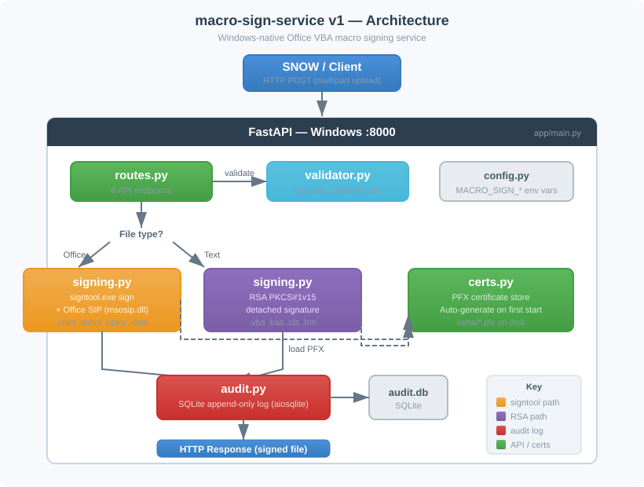

# macro-sign-service v1

Windows-native FastAPI service for signing Office VBA macros using `signtool.exe` + Office SIP DLLs.

> **Runs natively on Windows.** No WSL, no Docker, no Linux agent. One process, one machine, one `signtool` call.

---

## PRD — Product Requirements

### Problem

Teams manually sign Office VBA macros because the previous `macro-sign-service` used an overengineered Linux-to-Windows agent architecture. Office VBA signing **requires** Windows (`signtool.exe` + Office SIP DLLs). A Linux intermediary added WSL networking issues, HTTP delegation complexity, and deployment friction.

### Solution

A single lightweight FastAPI service running natively on a Windows laptop or Windows VM. SNOW calls it directly.

### Acceptance Criteria

| # | Requirement | Status |
|---|-------------|--------|
| 1 | POST `.xlsm` → receive signed `.xlsm` (certificate visible in Excel VBA editor) | Implemented |
| 2 | POST `.docm`/`.pptm` → same for Word/PowerPoint | Implemented |
| 3 | POST `.vba`/`.bas`/`.cls` → receive RSA detached signature + original file | Implemented |
| 4 | Health endpoint reports signtool, Office SIP, and cert status | Implemented |
| 5 | Auto-generates code-signing certificate on first start if none exists | Implemented |
| 6 | SQLite audit log for all signing operations | Implemented |
| 7 | Installable as Windows Service via NSSM | Documented |
| 8 | Test suite uses **real signtool.exe** — no mocking of signing path | Implemented |
| 9 | Total: ~8 Python source files | 8 files |

### Non-Goals

- No Celery, Redis, PostgreSQL, Docker, or Linux support
- No JWT/RBAC — single API key auth is sufficient
- No file storage — sign and return, stateless

---

## Architecture

<p align="center">
  
</p>

```
SNOW / Client
     │
     │  HTTP POST (multipart file upload)
     ▼
┌──────────────────────────────────────────┐
│         FastAPI  (Windows :8000)         │
│                                          │
│  routes.py ─► validator.py               │
│      │                                   │
│      ├── Office file? ──► signing.py     │
│      │   (.xlsm/.docm)    signtool.exe   │
│      │                     + Office SIP   │
│      │                                   │
│      └── Text macro? ───► signing.py     │
│          (.vba/.bas/.cls)  RSA PKCS#1v15 │
│                                          │
│  certs.py ── PFX cert store (auto-gen)   │
│  audit.py ── SQLite audit log            │
│  config.py ─ env vars (.env)             │
└──────────────────────────────────────────┘
```

### Component Summary

| File | Responsibility |
|------|----------------|
| `app/main.py` | FastAPI app, lifespan (startup/shutdown), uvicorn entry point |
| `app/config.py` | All settings from environment variables (`MACRO_SIGN_*` prefix) |
| `app/routes.py` | 6 API endpoints: sign, verify, health, certs, audit |
| `app/signing.py` | `signtool.exe` wrapper (Office files) + RSA signing (text macros) |
| `app/certs.py` | PFX certificate store — load from disk, auto-generate default |
| `app/validator.py` | File validation: extension, size, content scan |
| `app/audit.py` | Append-only SQLite audit log via `aiosqlite` |
| `app/__init__.py` | Version string |

### Signing Flow

**Office files** (`.xlsm`, `.docm`, `.pptm`, `.xlam`, `.dotm`, `.ppam`):
1. Write uploaded file + PFX cert to temp directory
2. Run `signtool.exe sign /f cert.pfx /fd SHA256 /v file.xlsm`
3. Office SIP DLLs (`msosip.dll`) intercept and sign the VBA project stream
4. Run `signtool.exe verify /pa /v file.xlsm` to confirm
5. Return signed file as base64

**Text macros** (`.vba`, `.bas`, `.cls`, `.frm`):
1. Load private key from PFX
2. Create RSA PKCS#1v15 detached signature over file content
3. Return original file + signature as base64

### Why Windows-Only

Office VBA project signing requires Microsoft's Office SIP (Subject Interface Package) DLLs. These are installed automatically with Microsoft Office on Windows. They register with Windows CryptoAPI and tell `signtool.exe` how to locate, hash, and embed a digital signature inside the VBA project stream of an Office compound document.

Without the Office SIP DLLs, any signing tool (osslsigncode, Set-AuthenticodeSignature, etc.) produces an Authenticode signature on the file envelope — which Office **ignores** when checking VBA macro signatures.

---

## API Reference

| Method | Path | Purpose |
|--------|------|---------|
| `POST` | `/api/v1/sign` | Upload macro file → get signed file back |
| `POST` | `/api/v1/verify` | Upload signed file → signtool verify result |
| `GET` | `/api/v1/health` | signtool + SIP + cert status |
| `GET` | `/api/v1/certs` | List available certificates |
| `GET` | `/api/v1/certs/{name}` | Certificate X.509 details |
| `GET` | `/api/v1/audit` | Query audit logs |

### POST /api/v1/sign

**Request:** multipart form upload

| Field | Type | Required | Description |
|-------|------|----------|-------------|
| `file` | file | Yes | The macro file to sign |
| `cert_name` | query | No | Certificate name (default: `default`) |
| `algorithm` | query | No | `SHA256`, `SHA384`, `SHA512` (default: `SHA256`) |
| `requester_id` | query | No | Caller identifier for audit trail |

**Response (Office file):**
```json
{
  "file_b64": "<base64 signed file>",
  "filename": "report.xlsm",
  "signing_method": "signtool-office-sip",
  "certificate_fingerprint": "a1b2c3...",
  "algorithm": "SHA256",
  "signed_at": "2026-03-17T10:00:00+00:00",
  "verification_passed": true
}
```

**Response (text macro):**
```json
{
  "file_b64": "<base64 original file>",
  "signature_b64": "<base64 RSA signature>",
  "filename": "module.vba",
  "signing_method": "rsa-detached",
  "certificate_fingerprint": "a1b2c3...",
  "algorithm": "SHA256",
  "signed_at": "2026-03-17T10:00:00+00:00"
}
```

### Authentication

Optional API key via `X-API-Key` header. Set `MACRO_SIGN_API_KEY` in `.env` to enable. Leave blank to disable auth.

---

## Deployment

### Prerequisites

| Requirement | Why | How to check |
|-------------|-----|--------------|
| **Windows 10/11 or Server 2019+** | signtool.exe + Office SIP are Windows-only | `systeminfo` |
| **Microsoft Office** (any edition) | Provides `msosip.dll` SIP DLLs | Check `C:\Program Files\Microsoft Office\root\Office16\msosip.dll` |
| **Windows SDK** | Provides `signtool.exe` | `where signtool` or check `C:\Program Files (x86)\Windows Kits\10\bin\` |
| **Python 3.10+** | Runtime | `py --version` |

### Option A — Run on your Windows laptop

```powershell
# Clone or copy the repo
cd C:\Projects\macro-sign-service\macro-sign-service-v1

# Create virtual environment
py -m venv venv
venv\Scripts\activate

# Install
pip install -e ".[dev]"

# (Optional) Copy .env.example to .env and edit
copy .env.example .env

# Run
py -m app.main
```

Open http://localhost:8000/docs for the interactive Swagger UI.

**Quick test:**
```powershell
# Sign a .xlsm file
curl -X POST http://localhost:8000/api/v1/sign -F "file=@C:\path\to\report.xlsm"

# Check health
curl http://localhost:8000/api/v1/health
```

### Option B — Windows VM deployment

1. **Provision** a Windows Server VM with Office + Windows SDK installed.

2. **Copy the service** to the VM:
   ```powershell
   # On the VM
   mkdir C:\macro-sign-service-v1
   # Copy files via RDP, SCP, or git clone
   ```

3. **Install and run:**
   ```powershell
   cd C:\macro-sign-service-v1
   py -m venv venv
   venv\Scripts\activate
   pip install -e .

   # Configure
   copy .env.example .env
   notepad .env   # Set API key, port, etc.

   # Run
   py -m app.main
   ```

4. **Open firewall** for the service port:
   ```powershell
   New-NetFirewallRule -DisplayName "Macro Sign Service" `
       -Direction Inbound -Protocol TCP -LocalPort 8000 -Action Allow
   ```

5. **Verify from SNOW or another machine:**
   ```powershell
   curl http://<vm-ip>:8000/api/v1/health
   ```

### Option C — Windows Service (persistent via NSSM)

For production, install as a Windows Service so it starts on boot and auto-restarts on failure:

```powershell
# Download NSSM: https://nssm.cc/download
# Place nssm.exe in PATH or C:\tools\

# Install the service
nssm install MacroSignService "C:\macro-sign-service-v1\venv\Scripts\python.exe" "-m" "app.main"
nssm set MacroSignService AppDirectory "C:\macro-sign-service-v1"
nssm set MacroSignService Description "Office VBA macro signing service"
nssm set MacroSignService Start SERVICE_AUTO_START

# Start
nssm start MacroSignService

# Check status
nssm status MacroSignService

# View logs (stdout/stderr captured by NSSM)
nssm get MacroSignService AppStdout
nssm get MacroSignService AppStderr
```

To uninstall:
```powershell
nssm stop MacroSignService
nssm remove MacroSignService confirm
```

---

## Configuration

All settings via environment variables with `MACRO_SIGN_` prefix. Create a `.env` file from `.env.example`:

| Variable | Default | Description |
|----------|---------|-------------|
| `MACRO_SIGN_HOST` | `0.0.0.0` | Bind address |
| `MACRO_SIGN_PORT` | `8000` | Bind port |
| `MACRO_SIGN_CERTS_DIR` | `certs` | Directory for PFX certificate files |
| `MACRO_SIGN_DEFAULT_CERT_NAME` | `default` | Default certificate for signing |
| `MACRO_SIGN_PFX_PASSWORD` | *(empty)* | Password for PFX files |
| `MACRO_SIGN_DB_PATH` | `audit.db` | SQLite audit database path |
| `MACRO_SIGN_API_KEY` | *(empty)* | API key for auth (blank = disabled) |
| `MACRO_SIGN_MAX_FILE_SIZE_MB` | `50` | Maximum upload file size |
| `MACRO_SIGN_ALLOWED_EXTENSIONS` | `.xlsm,.docm,...` | Comma-separated allowed extensions |

---

## Project Structure

```
macro-sign-service-v1/
├── app/
│   ├── __init__.py          # Version string
│   ├── main.py              # FastAPI app, lifespan, uvicorn entry
│   ├── config.py            # pydantic-settings (env vars)
│   ├── signing.py           # signtool wrapper + RSA signing
│   ├── certs.py             # PFX cert store (directory-based)
│   ├── validator.py         # File validation
│   ├── audit.py             # SQLite audit logger
│   └── routes.py            # All API endpoints
├── certs/                   # PFX files (gitignored)
├── tests/
│   ├── conftest.py          # Fixtures, test client, Office file helpers
│   ├── test_signing.py      # Real signtool tests (no mocks)
│   ├── test_routes.py       # API integration tests
│   ├── test_validator.py    # Validation unit tests
│   └── test_certs.py        # Cert store unit tests
├── docs/
│   └── architecture.svg     # Architecture diagram
├── pyproject.toml
├── .env.example
├── .gitignore
└── README.md
```

---

## Tests

```powershell
# Run all tests
pytest tests/ -v

# Run specific test file
pytest tests/test_signing.py -v

# Run only non-Windows tests (for CI on Linux)
pytest tests/ -v -k "not signtool and not office"
```

**Test matrix:**

| Test file | Count | Platform |
|-----------|-------|----------|
| `test_certs.py` | 13 | All |
| `test_validator.py` | 11 | All |
| `test_signing.py` (RSA) | 4 | All |
| `test_signing.py` (signtool) | 4 | Windows only |
| `test_routes.py` (API) | 12 | All |
| `test_routes.py` (Office) | 3 | Windows only |
| **Total** | **47** | |

---

## Manual Verification

After starting the service on Windows:

1. Open http://localhost:8000/docs (Swagger UI)
2. Upload a `.xlsm` file via POST `/api/v1/sign`
3. Decode the `file_b64` response and save as `.xlsm`
4. Open in Excel → Alt+F11 → Tools → Digital Signature
5. Certificate should be visible in the dialog
